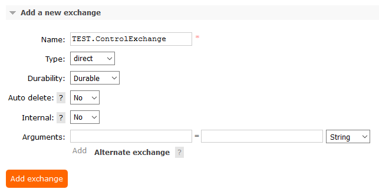
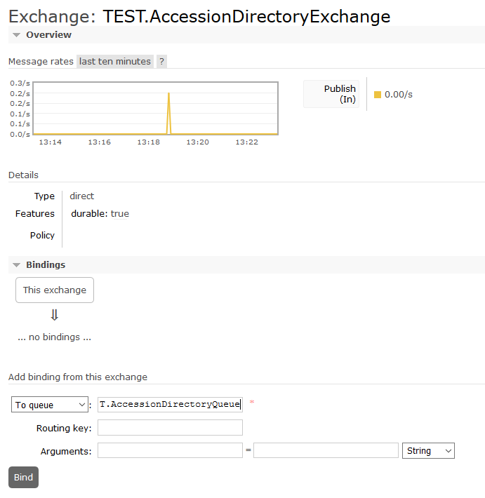
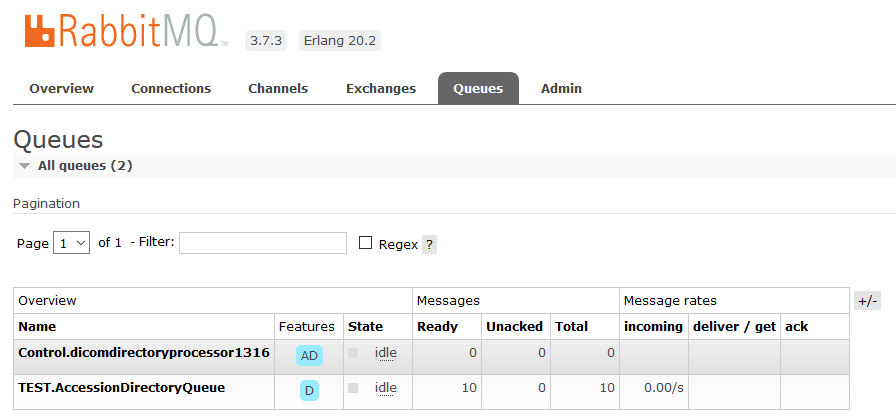
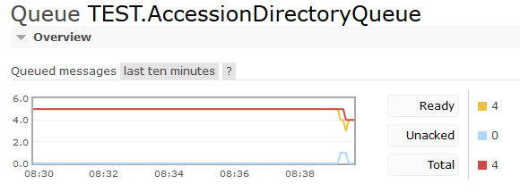
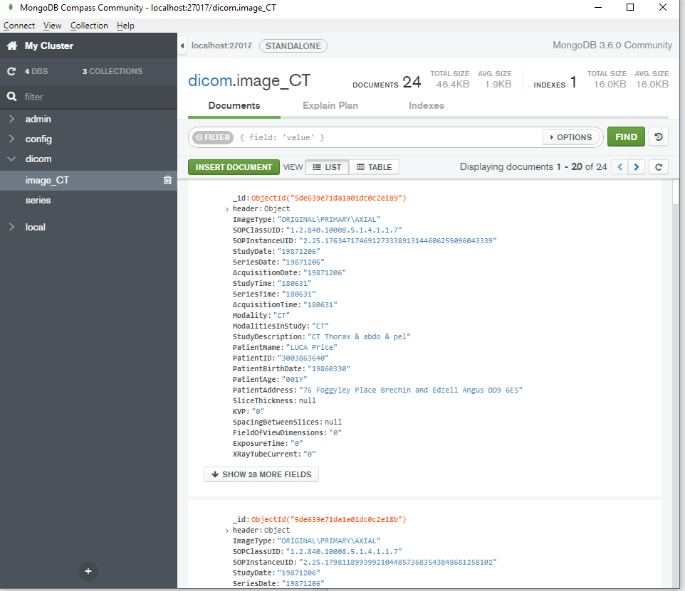
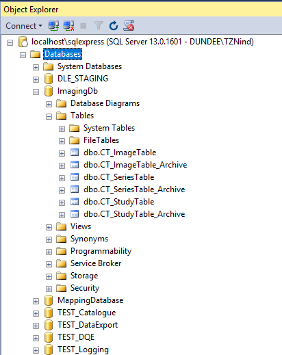

# Data Loading

## Contents

- [Background](#background)
  - [MongoDb]
  - [RelationalDb]
- [Preparation](#preparation)
  - [Publish Binaries](#publish-binaries)
- [MongoDb Loading Microservices](#mongodb-loading-microservices)
  - [DicomDirectoryProcessor](#dicomdirectoryprocessor)
  - [DicomTagReader](#dicomtagreader)
    - [Dead Letter Exchange](#dead-letter-exchange)
  - [DicomTagReader Continued](#dicomtagreader-continued)
  - [MongoDbPopulator](#mongodbpopulator)
- [RelationalDb Loading Microservices](#relationaldb-loading-microservices)
  - [DicomReprocessor](#dicomreprocessor)
  - [IdentifierMapper](#identifiermapper)
  - [DicomRelationalMapper](#dicomrelationalmapper)
    - [Installing RDMP](#installing-rdmp)
    - [Picking the Schema](#picking-the-schema)
    - [Building the load](#building-the-load)
  - [DicomRelationalMapper Continued](#dicomrelationalmapper-continued)

## Background

This document describes all the steps required to setup data load microservices and use them to load a collection of Dicom images.

Microservices are designed to execute in parallel and scale to support hundreds of millions of dicom image files.

The data load process populates two databases:

 - Mongo Db (identifiable)
 - Relational Db (anonymous)

### MongoDb

The Mongo Db database stores all (non pixel) dicom tags and file paths for all dicom images.  It can be used for understanding what data you have (modalities, date ranges, image types etc) and serves as the input source for the subsequent relational database.

MongoDb is used because it is designed to store wide (many columns) and tree structures (e.g. dicom tags with the value representation SQ - sequence).

### RelationalDb

The Relational Db (e.g. Sql Server, MySql, Oracle or Postgres) stores only the tags required for cohort creation and image extraction (e.g. StudyDate, [PatientID], Modality, StudyDescription etc).  The RelationalDb should only be loaded with images that are fit for release (can be anonymised) and only anonymised tags should be loaded (this includes performing identifier substitution e.g. for PatientID).

A relational database is used because it allows easier linking with other traditional EHR data (e.g. prescribing, biochemistry etc) held by a safehaven.


## Preparation

Download [BadDicom] and use it to generate some test images on disk:

```
BadDicom.exe c:\temp\testdicoms
```


Ensure Mongo Db is running e.g.:

```
C:\Program Files\MongoDB\Server\3.6\bin> ./mongod
```

Ensure RabbitMQ is running e.g.:

```
C:\Program Files\RabbitMQ Server\rabbitmq_server-3.7.3\sbin> .\rabbitmq-server.bat start
```

Ensure the target DBMS is running e.g.:

```
E:\mysql-5.7.19-winx64\bin> ./mysqld
```

Delete all RabbitMQ exchanges and queues:

```
http://127.0.0.1:15672/#/queues
```

Follow instructions listed in https://stackoverflow.com/a/52002145/4824531

### Publish Binaries

For each microservice run `dotnet publish -r win-x64` e.g.

```
E:\SmiServices\src\applications\Applications.DicomDirectoryProcessor> dotnet publish -r win-x64
```


## MongoDb Loading Microservices

The following process are responsible for loading the [MongoDb] with

### DicomDirectoryProcessor

Run `DicomDirectoryProcessor` with the directory you created test dicom files in e.g.:

```
E:\SmiServices\src\applications\Applications.DicomDirectoryProcessor\bin\AnyCPU\Debug\netcoreapp2.2\win-x64> .\DicomDirectoryProcessor.exe -d C:\temp\testdicoms
```

This may cause the following error:

```
Failed to construct host:
System.IO.FileNotFoundException: Could not find the logging configuration in the current directory (Smi.NLog.config),
```

Copy and modify (if needed) [Smi.NLog.config] to the binary directory


Run the application again, this time you should see:

```
Failed to construct host:
System.ApplicationException: The given control exchange was not found on the server: "TEST.ControlExchange"
```

Create the exchange:

---



---

This is the exchange by which you can send runtime messages (e.g. shutdown) to the service

Now when it is run you will see an error relating to another missing exchange (probably `TEST.AccessionDirectoryExchange`)

Create the following exchanges:

- TEST.AccessionDirectoryExchange
- TEST.FatalLoggingExchange

Now when running you should see an error:

```
2019-12-02 13:18:50.6045|FATAL|DicomDirectoryProcessorHost|Could not confirm message published after timeout|System.ApplicationException: Could not confirm message published after timeout
```

This is because there is no queue associated with the output exchange.  Create a queue `TEST.AccessionDirectoryQueue`

---


---
Bind the `TEST.AccessionDirectoryExchange` exchange with the queue `TEST.AccessionDirectoryQueue`:

---



---

Once you have done this you should see output from the program like:

```
PS E:\SmiServices\src\applications\Applications.DicomDirectoryProcessor\bin\AnyCPU\Debug\netcoreapp2.2\win-x64> .\DicomDirectoryProcessor.exe -d C:\temp\testdicoms
Bootstrapper -> Main called, constructing host
2019-12-02 13:25:45.6886| INFO|DicomDirectoryProcessorHost|Host logger created with SMI logging config|||
2019-12-02 13:25:45.7365| INFO|DicomDirectoryProcessorHost|Started DicomDirectoryProcessor:5468|||
2019-12-02 13:25:45.8932| INFO|DicomDirectoryProcessorHost|Creating basic directory finder|||
Bootstrapper -> Host constructed, starting aux connections
Bootstrapper -> Host aux connections started, calling Start()
2019-12-02 13:25:45.9435| INFO|BasicDicomDirectoryFinder|Starting directory scan of: C:\temp\testdicoms|||
2019-12-02 13:25:46.1277| INFO|BasicDicomDirectoryFinder|Directory scan finished|||
2019-12-02 13:25:46.1277| INFO|BasicDicomDirectoryFinder|Total messages sent: 10|||
2019-12-02 13:25:46.1277| INFO|BasicDicomDirectoryFinder|Largest stack size was: 10|||
2019-12-02 13:25:46.1277| INFO|BasicDicomDirectoryFinder|Averages:
NewDirInfo:     0ms
EnumFiles:      0ms
FirstOrDef:     0ms
FoundNewDir:    17ms
EnumDirs:       0ms
PushDirs:       0ms
|||
2019-12-02 13:25:46.1277| INFO|DicomDirectoryProcessorHost|Host Stop called: Directory scan completed|||
2019-12-02 13:25:46.4812| INFO|DicomDirectoryProcessorHost|Host stop completed|||
Bootstrapper -> Host started
Bootstrapper -> Exiting main
```

There should be 1 message per folder in the your test dicoms directory:

---



---

If you use GetMessages in the rabbit MQ interface you can see what was the messages contain:

---


---

Thats right, all this work was just to get a __directory listing__ into RabbitMQ! But now that you have the basics of creating exchanges / queues down it should be much easier to get the rest of the services running (see below).

To change the exchange/queue names you should edit `default.yaml` (ensuring your RabbitMQ server has the correct entries)

### DicomTagReader

Publish and run DicomTagReader (copy across [Smi.NLog.config] if needed) e.g.:

```
E:\SmiServices\src\microservices\Microservices.DicomTagReader\bin\AnyCPU\Debug\netcoreapp2.2\win-x64> ./DicomTagReader.exe
```

This should result in an error about `TEST.IdentifiableSeriesExchange`.  Create the following exchanges:

- TEST.IdentifiableSeriesExchange
- TEST.IdentifiableImageExchange

This should cause our old friend:

```
Could not confirm message published after timeout
```

Notice also that a queue message has still been consumed and we have 1 less message in the `TEST.AccessionDirectoryQueue`

---



_RabbitMQ queue graph are 1 less message available for processing_

---

Messages that cannot be processed are 'nacked' and not returned to the processing queue.  This prevents 'bad' messages getting served up repeatedly to consumers and degrading system performance.  To prevent message loss we can set up a dead letter exchange.


#### Dead Letter Exchange

Create an internal exchange and queue for the dead letters:

- DeadLetterExchange
  - DeadLetterQueue

Now create a policy for all queues to send nacked messages to this exchange:

---


---

Run DicomTagReader again to force another failure (because we still have no bound output queue for our succesfully processed messages)

This should result in the 'lost' message being sent to the dead letter queue:

---


_The unprocessed message now resides in the dead letter queue_

---

### DicomTagReader Continued

Create the output queues for the tag reader exchanges (make sure to bind them to the correct exchanges):

- TEST.IdentifiableSeriesExchange
  - TEST.IdentifiableSeriesQueue
- TEST.IdentifiableImageExchange
  - TEST.IdentifiableImageQueue

This should produce the following output:

```
Bootstrapper -> Main called, constructing host
2019-12-03 09:09:42.1992| INFO|DicomTagReaderHost|Host logger created with SMI logging config|||
2019-12-03 09:09:42.2524| INFO|DicomTagReaderHost|Started DicomTagReader:17464|||
Bootstrapper -> Host constructed, starting aux connections
2019-12-03 09:09:42.5133| INFO|SerialTagReader|Stopwatch implementation - IsHighResolution: True. Frequency: 10000000 ticks/s|||
Bootstrapper -> Host aux connections started, calling Start()
Bootstrapper -> Host started
Bootstrapper -> Exiting main
2019-12-03 09:09:43.2117| INFO|SerialTagReader|Sending 8 DicomFileMessage(s)|||
2019-12-03 09:09:43.2553| INFO|SerialTagReader|Sending 2 SeriesMessage(s)|||
2019-12-03 09:09:43.3095| INFO|SerialTagReader|Sending 8 DicomFileMessage(s)|||
2019-12-03 09:09:43.3353| INFO|SerialTagReader|Sending 2 SeriesMessage(s)|||
2019-12-03 09:09:43.4184| INFO|SerialTagReader|Sending 8 DicomFileMessage(s)|||
2019-12-03 09:09:43.4330| INFO|SerialTagReader|Sending 2 SeriesMessage(s)|||
```

The binary will not exit by default (it will wait for more messages).  Use Ctrl+C to trigger shutdown of the binary.

```
2019-12-03 09:10:59.0453| INFO|SerialTagReader|Lock released, no more messages will be processed|||
2019-12-03 09:10:59.0453| INFO|SerialTagReader|Average rates - enumerate dir (per acc. message): 0.001034s, file process: 0.002731s, send messages: 0.003534s, overall: 0.211906s|||
2019-12-03 09:10:59.0453| INFO|DicomTagReaderHost|Host Stop called: Ctrl+C pressed|||
2019-12-03 09:10:59.5284| INFO|DicomTagReaderHost|Host stop completed|||
```

After execution the queues should look like:

---


_Output queues from a succesful run of DicomTagReader_

---

If you peek at the messages in the `TEST.IdentifiableImageExchange`.  You should see the JSON representation of a dicom image (tags only - no pixel data):

```
Exchange 	TEST.IdentifiableImageExchange
timestamp:	1575364183
delivery_mode:	2
headers:	
MessageGuid:	a5f2ad28-6f87-49b6-b417-e87c425d74c1
OriginalPublishTimestamp:	1575293146
Parents:	90429bb7-5650-4ea0-922e-082cfc7befcc
ProducerExecutableName:	DicomTagReader
ProducerProcessID:	17464
content_encoding:	UTF-8
content_type:	application/json
Payload
2802 bytes
Encoding: string
	
{"NationalPACSAccessionNumber":"6","DicomFilePath":"testdicoms\\1987\\12\\6\\2.25.176347174691273338913144606255096043339.dcm","StudyInstanceUID":"2.25.124865355268738178415667314856224778478","SeriesInstanceUID":"2.25.268908360241165259234396963267293474168","SOPInstanceUID":"2.25.176347174691273338913144606255096043339","DicomDataset":"{\"00080008\":{\"vr\":\"CS\",\"val\":\"ORIGINAL\\\\PRIMARY\\\\AXIAL\"},\"00080016\":{\"vr\":\"UI\",\"val\":\"1.2.840.10008.5.1.4.1.1.7\"},\"00080018\":{\"vr\":\"UI\",\"val\":\"2.25.176347174691273338913144606255096043339\"},\"00080020\":{\"vr\":\"DA\",\"val\":\"19871206\"},\"00080021\":{\"vr\":\"DA\",\"val\":\"19871206\"},\"00080022\":{\"vr\":\"DA\",\"val\":\"19871206\"},\"00080030\":{\"vr\":\"TM\",\"val\":\"180631\"},\"00080031\":{\"vr\":\"TM\",\"val\":\"180631\"},\"00080032\":{\"vr\":\"TM\",\"val\":\"180631\"},\"00080060\":{\"vr\":\"CS\",\"val\":\"CT\"},\"00080061\":{\"vr\":\"CS\",\"val\":\"CT\"},\"00081030\":{\"vr\":\"LO\",\"val\":\"CT Thorax & abdo & pel\"},\"00100010\":{\"vr\":\"PN\",\"val\":\"LUCA Price\"},\"00100020\":{\"vr\":\"LO\",\"val\":\"3003863640\"},\"00100030\":{\"vr\":\"DA\",\"val\":\"19860330\"},\"00101010\":{\"vr\":\"AS\",\"val\":\"001Y\"},\"00101040\":{\"vr\":\"LO\",\"val\":\"76 Foggyley Place Brechin and Edzell Angus DD9 6ES\"},\"00180050\":{\"vr\":\"DS\"},\"00180060\":{\"vr\":\"DS\",\"val\":\"0\"},\"00180088\":{\"vr\":\"DS\"},\"00181149\":{\"vr\":\"IS\",\"val\":\"0\"},\"00181150\":{\"vr\":\"IS\",\"val\":\"0\"},\"00181151\":{\"vr\":\"IS\",\"val\":\"0\"},\"00181152\":{\"vr\":\"IS\",\"val\":\"0\"},\"00189311\":{\"vr\":\"FD\",\"val\":[0.0]},\"00189461\":{\"vr\":\"FL\",\"val\":[0.0]},\"0020000D\":{\"vr\":\"UI\",\"val\":\"2.25.124865355268738178415667314856224778478\"},\"0020000E\":{\"vr\":\"UI\",\"val\":\"2.25.268908360241165259234396963267293474168\"},\"00200011\":{\"vr\":\"IS\",\"val\":\"0\"},\"00200012\":{\"vr\":\"IS\",\"val\":\"0\"},\"00200032\":{\"vr\":\"DS\",\"val\":\"0\\\\0\\\\0\"},\"00201041\":{\"vr\":\"DS\"},\"00201208\":{\"vr\":\"IS\",\"val\":\"2\"},\"00201209\":{\"vr\":\"IS\",\"val\":\"4\"},\"00280002\":{\"vr\":\"US\",\"val\":[3]},\"00280004\":{\"vr\":\"CS\"},\"00280006\":{\"vr\":\"US\",\"val\":[0]},\"00280008\":{\"vr\":\"IS\",\"val\":\"1\"},\"00280010\":{\"vr\":\"US\",\"val\":[500]},\"00280011\":{\"vr\":\"US\",\"val\":[500]},\"00280030\":{\"vr\":\"DS\",\"val\":\"0.3\\\\0.25\"},\"00280100\":{\"vr\":\"US\",\"val\":[8]},\"00280101\":{\"vr\":\"US\",\"val\":[8]},\"00280102\":{\"vr\":\"US\",\"val\":[7]},\"00280103\":{\"vr\":\"US\",\"val\":[0]},\"00280301\":{\"vr\":\"CS\",\"val\":\"NO\"},\"00282110\":{\"vr\":\"CS\",\"val\":\"00\"},\"00282112\":{\"vr\":\"DS\",\"val\":\"1\"},\"00282114\":{\"vr\":\"CS\",\"val\":\"ISO_10918_1\"},\"00400253\":{\"vr\":\"SH\",\"val\":\"0\"},\"7FE00010\":{\"vr\":\"OB\"}}"}
```

_A JSON serialized dicom dataset in RabbitMQ (this is __synthetic test data__ made up by the [BadDicom] tool)_

### MongoDbPopulator

The next microservice is responsible for persisting the dicom tag data into a MongoDb database.

Install and launch MongoDb Compas e.g.:

```
C:\Users\tznind\AppData\Local\MongoDBCompassCommunity\MongoDBCompassCommunity.exe
```

Your MongoDb instance should be blank (contain no imaging datasets at least):


Publish and run `MongoDbPopulator` (making sure to copy accross [Smi.NLog.config] if required)

```
E:\SmiServices\src\microservices\Microservices.MongoDbPopulator\bin\AnyCPU\Debug\netcoreapp2.2\win-x64> .\MongoDbPopulator.exe
```

This should give the following error `Expected queue "TEST.MongoSeriesQueue" to exist`.

MongoDbPopulator is designed to read the outputs from `DicomTagReader` but these outputs can also be forked to the relational database loading services to load both databases simultaneously.  For now lets stick with loading MongoDb only (we can always start RelationalDb loading from mongo collections anyway).

Open `default.yaml` in the exe directory of MongoDbPopulator and set the `QueueName` entries under `MongoDbPopulatorOptions` to `TEST.IdentifiableSeriesQueue` and `TEST.IdentifiableImageQueue`

```yaml
MongoDbPopulatorOptions:
    SeriesQueueConsumerOptions:
        QueueName: 'TEST.IdentifiableSeriesQueue'
        QoSPrefetchCount: 1000
        AutoAck: false
    ImageQueueConsumerOptions:
        QueueName: 'TEST.IdentifiableImageQueue'
        QoSPrefetchCount: 10000
        AutoAck: false
    MongoDbFlushTime: 30 # Seconds
    FailedWriteLimit: 5
```

_The MongoDbPopulator section of default.yaml should now look like this_

Run `MongoDbPopulator` again.  It should result in the following:

```
Bootstrapper -> Main called, constructing host
2019-12-03 10:32:40.4703| INFO|MongoDbPopulatorHost|Host logger created with SMI logging config|||
2019-12-03 10:32:40.5180| INFO|MongoDbPopulatorHost|Started MongoDbPopulator:7616|||
Bootstrapper -> Host constructed, starting aux connections
Bootstrapper -> Host aux connections started, calling Start()
2019-12-03 10:32:41.1959| INFO|MongoDbPopulatorHost|Starting consumers|||
Bootstrapper -> Host started
Bootstrapper -> Exiting main
2019-12-03 10:32:41.2108| INFO|MongoDbPopulatorHost|Consumers successfully started|||
2019-12-03 10:33:11.1579| INFO|Microservices.MongoDBPopulator.Execution.MongoDbAdapter|Attempting bulk write of 6 documents to dicom.series|||
2019-12-03 10:33:11.1579| INFO|ImageMessageProcessor|Queue contains 24 message to write|||
2019-12-03 10:33:11.1838| INFO|Microservices.MongoDBPopulator.Execution.MongoDbAdapter|Attempting bulk write of 24 documents to dicom.image_CT|||
```

Your MongoDb instance should now have 2 new collections `image_CT` and `series`.  The queues should also be fully drained of messages.



_Mongo Db after MongoDbPopulator has run_

## RelationalDb Loading Microservices

The following microservices are responsible for loading the [RelationalDb] with anonymised tag data (and file paths) for downstream cohort creation, linkage and extraction processes.

### DicomReprocessor

This application is responsible for fetching records from [MongoDb] collections and queuing them for processing in RabbitMQ.

Publish and run `DicomReprocessor` (making sure to copy accross [Smi.NLog.config] if required)

```
E:\SmiServices\src\microservices\Microservices.DicomReprocessor\bin\AnyCPU\Debug\netcoreapp2.2\win-x64> .\DicomReprocessor.exe
```

This should display the following helpful prompt:

```
ERROR(S):
  Required option 'c, collection-name' is missing.
USAGE:
Normal Scenario:
  DicomReprocessor --collection-name image_CT
```

Add the missing parameter, this should be the name of the collection loaded by [MongoDbPopulator] e.g. `image_CT`

```
DicomReprocessor.exe -c image_CT --auto-run
```

This should give us the error:

```
BasicReturn for Exchange 'TEST.IdentifiableImageExchange' Routing Key 'reprocessed' ReplyCode '312' (NO_ROUTE)
````

This is because `DicomReprocessor` is designed to feed images identified in MongoDb to any number of downstream processes of which loading the [RelationalDb] is only one.  To this end it requires a RabbitMQ exchange that can handle routing keys (i.e. to different destination queues).

Since we only want to send the messages on to one queue we can create a `fanout` exchange as the destination.  Create a new `fanout` exchange with a destination queue:

- TEST.DicomReprocessorExchange `(fanout)`
  - TEST.DicomReprocessorQueue

Edit `default.yaml` and set the `DicomReprocessorOptions` to use the new exchange.

```yaml
DicomReprocessorOptions:
    ProcessingMode: 'ImageReprocessing'
    ReprocessingProducerOptions: 
        ExchangeName: 'TEST.DicomReprocessorExchange'
        MaxConfirmAttempts: 1
```

This should give the following succesful output (see below) and there should be image messages in the `TEST.DicomReprocessorQueue`

```
Bootstrapper -> Main called, constructing host
2019-12-04 09:09:47.6406| INFO|DicomReprocessorHost|Host logger created with SMI logging config|||
2019-12-04 09:09:47.6793| INFO|DicomReprocessorHost|Started DicomReprocessor:34748|||
2019-12-04 09:09:47.8743| INFO|DicomReprocessorHost|Documents will be reprocessed to TEST.DicomReprocessorExchange on vhost / with routing key "reprocessed"|||
Bootstrapper -> Host constructed, starting aux connections
Bootstrapper -> Host aux connections started, calling Start()
2019-12-04 09:09:48.1199| INFO|Smi.Common.MongoDB.MongoQueryParser|No query specified, fetching all records in collection|||
2019-12-04 09:09:48.3837| INFO|MongoDbReader|Using MaxDegreeOfParallelism: 4|||
2019-12-04 09:09:48.3837| INFO|MongoDbReader|Batch size is: unspecified|||
2019-12-04 09:09:48.3837| INFO|MongoDbReader|Sleeping for 0ms between batches|||
2019-12-04 09:09:48.3837| INFO|MongoDbReader|Starting reprocess operation|||
2019-12-04 09:09:48.9120| INFO|MongoDbReader|Reprocessing finished or cancelled, time elapsed: 0:00:00.529213|||
2019-12-04 09:09:48.9120| INFO|DicomReprocessorHost|Total messages sent: 24|||
2019-12-04 09:09:48.9120| INFO|DicomReprocessorHost|Total failed to reprocess : 0|||
2019-12-04 09:09:48.9120| INFO|DicomReprocessorHost|Average documents processed per second: 45|||
2019-12-04 09:09:48.9120| INFO|MongoDbReader|Cancelling the running query|||
2019-12-04 09:09:48.9120| INFO|DicomReprocessorHost|Host Stop called: Reprocessing completed|||
2019-12-04 09:09:49.1352| INFO|DicomReprocessorHost|Host stop completed|||
Bootstrapper -> Host started
Bootstrapper -> Exiting main
```

## IdentifierMapper

The next component in the load is the `IdentifierMapper`.  It's job is to anonymise the [PatientID] tag in the JSON extraced by [DicomReprocessor].  This change only occurs in the messages in the rabbit (as they are written to the output queue).  This prepares them for loading into the [RelationalDb].  

At no point are the original Dicom files on disk opened or changed.


Publish and run `IdentifierMapper` (making sure to copy accross [Smi.NLog.config] if required)

```
E:\SmiServices\src\microservices\Microservices.IdentifierMapper\bin\AnyCPU\Debug\netcoreapp2.2\win-x64> .\IdentifierMapper.exe
```

Amongst the error messages should be the following interesting bits:

```
2019-12-04 09:27:51.3405| INFO|Smi.Common.Helpers.MicroserviceObjectFactory|Successfully constructed Type 'Microservices.IdentifierMapper.Execution.Swappers.ForGuidIdentifierSwapper'|||
2019-12-04 09:27:51.3405| INFO|IdentifierMapperHost|Calling Setup on swapper|||
Failed to construct host:
System.ArgumentException: MappingTableName did not contain the database/user section:'MappingTable'
```

`IdentifierMapper` uses a [strategy pattern] to determine how identifiers are substituted.  The following implementations are provided out of the box:

  - [ForGuidIdentifierSwapper]
  - [TableLookupSwapper]

We will use the [ForGuidIdentifierSwapper] because it doesn't require us to create an identiifer mapping up front.  Open `default.yaml` and edit the `IdentifierMapperOptions` settings e.g.:

```yaml
IdentifierMapperOptions:
    QueueName: 'TEST.DicomReprocessorQueue'
    QoSPrefetchCount: 1000
    AutoAck: false
    AnonImagesProducerOptions: 
        ExchangeName: 'TEST.AnonymousImageExchange'
        MaxConfirmAttempts: 1
    MappingConnectionString: 'Server=localhost\sqlexpress;Integrated Security=true;Initial Catalog=MappingDatabase;'
    MappingDatabaseType: 'MicrosoftSQLServer'
    MappingTableName: 'MappingDatabase.MappingTable'
    TimeoutInSeconds: 600
    SwapColumnName: 'PatientID'
    ReplacementColumnName: 'GuidPatientID'
    SwapperType: 'Microservices.IdentifierMapper.Execution.Swappers.ForGuidIdentifierSwapper'
    AllowRegexMatching: false
```

Make sure the `QueueName` is set to the output queue of [DicomReprocessor] (e.g. `TEST.DicomReprocessorQueue`) and that the `MappingConnectionString` is correct for your Sql Server instance.

Create the output exchange and queue

- TEST.AnonymousImageExchange
  - TEST.AnonymousImageQueue

Run `IdentifierMapper` again with the new yaml settings.  It should complete and have written all messages to the output queue `TEST.AnonymousImageQueue`:

```
Bootstrapper -> Main called, constructing host
2019-12-04 09:49:34.1412| INFO|IdentifierMapperHost|Host logger created with SMI logging config|||
2019-12-04 09:49:34.1909| INFO|IdentifierMapperHost|Started IdentifierMapper:26312|||
2019-12-04 09:49:34.4561| INFO|IdentifierMapperHost|Not passed a swapper, creating one of type Microservices.IdentifierMapper.Execution.Swappers.ForGuidIdentifierSwapper|||
2019-12-04 09:49:34.4561| INFO|Smi.Common.Helpers.MicroserviceObjectFactory|Successfully constructed Type 'Microservices.IdentifierMapper.Execution.Swappers.ForGuidIdentifierSwapper'|||
2019-12-04 09:49:34.4561| INFO|IdentifierMapperHost|Calling Setup on swapper|||
2019-12-04 09:49:35.5203| INFO|Microservices.IdentifierMapper.Execution.Swappers.ForGuidIdentifierSwapper|Guid mapping table does not exist, creating it now|||
2019-12-04 09:49:35.5574| INFO|Microservices.IdentifierMapper.Execution.Swappers.ForGuidIdentifierSwapper|Guid mapping table exist (MappingTable)|||
2019-12-04 09:49:35.5574| INFO|Microservices.IdentifierMapper.Execution.Swappers.ForGuidIdentifierSwapper|Checking for column PatientID|||
2019-12-04 09:49:35.6333| INFO|Microservices.IdentifierMapper.Execution.Swappers.ForGuidIdentifierSwapper|Checking for column GuidPatientID|||
Bootstrapper -> Host constructed, starting aux connections
Bootstrapper -> Host aux connections started, calling Start()
Bootstrapper -> Host started
Bootstrapper -> Exiting main
```

If you look in your Sql Server database you should see a persistent record of the anonmised mapping.  This ensures that patients have consistent identifiers over time and no aliases are generated.


Notice that the PatientID is a primary key column to prevent aliases ever forming.  Multiple swappers can execute in parallel without risking aliases (e.g. due to race conditions) because lookup is performed in a single atomic transaction (SELECT if not exists INSERT).

If you peek at the messages in the `TEST.AnonymousImageQueue` you can see the new PatientID tag value:

```
Exchange 	TEST.AnonymousImageExchange
timestamp:	1575452976
delivery_mode:	2
headers:	
MessageGuid:	c1b441fe-eb20-4060-a1db-3d7a6b9cb5ec
OriginalPublishTimestamp:	1575293146
Parents:	91775bf2-196d-499f-b07a-26fa098d142a->68a6435d-33ac-4895-88e9-2e18d03671f9->13a78be9-8cbf-40a2-9e28-d7745561159f->204e1e39-c408-44c9-b484-edddf4e0b2a6
ProducerExecutableName:	IdentifierMapper
ProducerProcessID:	26312
content_encoding:	UTF-8
content_type:	application/json
Payload
2813 bytes
Encoding: string
	
{"NationalPACSAccessionNumber":"9","DicomFilePath":"testdicoms\\1958\\6\\9\\2.25.24425987081552946032369646390860332875.dcm","StudyInstanceUID":"2.25.39490047024894726575859340458560242419","SeriesInstanceUID":"2.25.200404735591937354156655516808405291743","SOPInstanceUID":"2.25.24425987081552946032369646390860332875","DicomDataset":"{\"00080008\":{\"vr\":\"CS\",\"val\":\"ORIGINAL\\\\PRIMARY\\\\AXIAL\"},\"00080016\":{\"vr\":\"UI\",\"val\":\"1.2.840.10008.5.1.4.1.1.7\"},\"00080018\":{\"vr\":\"UI\",\"val\":\"2.25.24425987081552946032369646390860332875\"},\"00080020\":{\"vr\":\"DA\",\"val\":\"19580609\"},\"00080021\":{\"vr\":\"DA\",\"val\":\"19580609\"},\"00080022\":{\"vr\":\"DA\",\"val\":\"19580609\"},\"00080030\":{\"vr\":\"TM\",\"val\":\"085353\"},\"00080031\":{\"vr\":\"TM\",\"val\":\"085353\"},\"00080032\":{\"vr\":\"TM\",\"val\":\"085353\"},\"00080060\":{\"vr\":\"CS\",\"val\":\"CT\"},\"00080061\":{\"vr\":\"CS\",\"val\":\"CT\"},\"00081030\":{\"vr\":\"LO\",\"val\":\"CT Head\"},\"00100010\":{\"vr\":\"PN\",\"val\":\"TOMMY Moore\"},\"00100020\":{\"vr\":\"LO\",\"val\":\"8f774005-6fe6-4a31-96d7-c454fbf7e323\"},\"00100030\":{\"vr\":\"DA\",\"val\":\"19560904\"},\"00101010\":{\"vr\":\"AS\",\"val\":\"001Y\"},\"00101040\":{\"vr\":\"LO\",\"val\":\"0 Tulloch Court Arbroath East and Lunan Angus  DD11 4RU\"},\"00180050\":{\"vr\":\"DS\"},\"00180060\":{\"vr\":\"DS\",\"val\":\"0\"},\"00180088\":{\"vr\":\"DS\"},\"00181149\":{\"vr\":\"IS\",\"val\":\"0\"},\"00181150\":{\"vr\":\"IS\",\"val\":\"0\"},\"00181151\":{\"vr\":\"IS\",\"val\":\"0\"},\"00181152\":{\"vr\":\"IS\",\"val\":\"0\"},\"00189311\":{\"vr\":\"FD\",\"val\":[0.0]},\"00189461\":{\"vr\":\"FL\",\"val\":[0.0]},\"0020000D\":{\"vr\":\"UI\",\"val\":\"2.25.39490047024894726575859340458560242419\"},\"0020000E\":{\"vr\":\"UI\",\"val\":\"2.25.200404735591937354156655516808405291743\"},\"00200011\":{\"vr\":\"IS\",\"val\":\"0\"},\"00200012\":{\"vr\":\"IS\",\"val\":\"0\"},\"00200032\":{\"vr\":\"DS\",\"val\":\"0\\\\0\\\\0\"},\"00201041\":{\"vr\":\"DS\"},\"00201208\":{\"vr\":\"IS\",\"val\":\"2\"},\"00201209\":{\"vr\":\"IS\",\"val\":\"4\"},\"00280002\":{\"vr\":\"US\",\"val\":[3]},\"00280004\":{\"vr\":\"CS\"},\"00280006\":{\"vr\":\"US\",\"val\":[0]},\"00280008\":{\"vr\":\"IS\",\"val\":\"1\"},\"00280010\":{\"vr\":\"US\",\"val\":[500]},\"00280011\":{\"vr\":\"US\",\"val\":[500]},\"00280030\":{\"vr\":\"DS\",\"val\":\"0.3\\\\0.25\"},\"00280100\":{\"vr\":\"US\",\"val\":[8]},\"00280101\":{\"vr\":\"US\",\"val\":[8]},\"00280102\":{\"vr\":\"US\",\"val\":[7]},\"00280103\":{\"vr\":\"US\",\"val\":[0]},\"00280301\":{\"vr\":\"CS\",\"val\":\"NO\"},\"00282110\":{\"vr\":\"CS\",\"val\":\"00\"},\"00282112\":{\"vr\":\"DS\",\"val\":\"1\"},\"00282114\":{\"vr\":\"CS\",\"val\":\"ISO_10918_1\"},\"00400253\":{\"vr\":\"SH\",\"val\":\"0\"},\"7FE00010\":{\"vr\":\"OB\"}}"}
```

The critical section in this JSON is `\"00100020\":{\"vr\":\"LO\",\"val\":\"8f774005-6fe6-4a31-96d7-c454fbf7e323\"}`.  The [PatientID] tag in dicom is `00100020` and we can see the that the value is the guid assigned by the swapper.

### DicomRelationalMapper

`DicomRelationalMapper` is responsible for loading the [RelationalDb] with the JSON serialized dicom images in it's RabbitMQ input queue.  

Loading research ready relational databases without introducing duplication is complicated and highly dependant on user requirements (e.g. desired table schema, any aggregate/computed columns etc).

To ensure maximum flexibility `DicomRelationalMapper` wraps the [RDMP] Data Load Engine (using the [Rdmp.Dicom] plugin)

#### Installing RDMP
    
In order to set up the data load (but not run it) you will need to install [RDMP].  This can be done through the windows client by following the instructions in the [RDMP User Manual].

Alternatively you can use the [command line client](https://github.com/HicServices/RDMP/releases).  Download and unzip the latest CLI package for your operating system (e.g. `rdmp-cli-win-x64.zip`)

Run the install command (if you need to use sql authentication use the -u and -p flags too)

```
./rdmp.exe install localhost\sqlexpress TEST_
```

This will create all the databases required for [RDMP] to run (including running data loads)


Edit `Databases.yaml` in the RDMP CLI directory so that the connection strings are correct for your server e.g.

```yaml
CatalogueConnectionString: Server=localhost\sqlexpress;Database=TEST_Catalogue;Trusted_Connection=True;
DataExportConnectionString: Server=localhost\sqlexpress;Database=TEST_DataExport;Trusted_Connection=True;
```

Next download the latest [Rdmp.Dicom] plugin version compatible with your RDMP binary (See the release notes of the plugin for version compatibility).  For example [Rdmp.Dicom.2.0.4.nupkg](https://github.com/HicServices/RdmpDicom/releases/tag/v2.0.4)

Add the plugin to RDMP with the CLI pack command (or through the [windows client](https://github.com/HicServices/RDMP/blob/develop/Documentation/CodeTutorials/Images/AddPluginContextMenu.png))

```
./rdmp pack --file C:\Users\tznind\Downloads\Rdmp.Dicom.2.0.4.nupkg
``` 

You should now find the command `CreateNewImagingDatasetSuite` is listed when you run

```
./rdmp cmd ListSupportedCommands
```

This confirms that both [RDMP] and the [Rdmp.Dicom] plugin are correctly installed.  If you don't see the command, try running with `--logstartup` to see any errors.

#### Picking the Schema

The [RelationalDb] can have any schema you want and of any [DBMS] supported by [RDMP].  `DicomRelationalMapper` will load all tables configured and populate any columns which are named after dicom tags (e.g. [PatientID], StudyDate, SeriesDate etc).  You can define a single large table or tables at different levels of granularity (e.g. Study / Series / Image).  Only unique records will be loaded (i.e. a study table would contain 1 entry per study not 1 per image with rampant duplication).

Schemas are defined in yaml.  There are a number of [existing templates](https://github.com/HicServices/DicomTypeTranslation/tree/master/Templates) you can pick from.  Alternatively you can build your own using the [Dicom Template Builder].

Download the [CT.it](https://raw.githubusercontent.com/HicServices/DicomTypeTranslation/master/Templates/CT.it) template.  Copy the contents into a [yaml validator](http://www.yamllint.com/) to ensure there were no problems with leading/trailing whitespace etc when you downloaded it.

#### Building the load
  
Once you have picked a schema you will need to run the `CreateNewImagingDatasetSuite` command in RDMP.  This can be [done through the windows client](https://github.com/HicServices/RdmpDicom/blob/develop/Documentation/DataLoad.md).

Alternatively you can run it from the rdmp console gui:

```
./rdmp gui
```

Press `F9` to access the menu and select `R` (Run).  Locate the `CreateNewImagingDatasetSuite` command and run it:


Enter the server/database name you want the tables created into.  __Make sure to select Create Database__ (if the database does not already exist).


- Select a 'project directory' this should be a directory on disk (that must exist) in which load scripts can be added later (all [RDMP] loads require a load folder regardless of whether they actually use it)
- Select DicomDatasetCollectionSource for the `dicomSourceType`
- Enter `CT_` when prompted for table prefix
- Select the `CT.it` template file when prompted

 

- Enter Yes for `persistentRAW` (this allows parallel loading)
- Enter Yes for `createLoad`

Run Refresh (`F9` Refresh `f`)

Now open the tree (`F9` Tree `t`) and search for "loadmetadata"

 

Select "SMI Image Loading CT", this will show all the operations created in the load

 

Take note of the ID of the load (in this case `1`).  You can see this in the search or by opening the load.

You can check the load by exiting (`F9` Quit `Q`) and running the command line checks

```
 ./rdmp dle -l 1 --command check
```

In Sql Server you should see tables (and archive tables) that match your template

 

### DicomRelationalMapper Continued

todo

[Smi.NLog.config]: ../data/logging/Smi.NLog.config
[BadDicom]: https://github.com/HicServices/BadMedicine.Dicom/releases
[MongoDb]: #mongodb
[RelationalDb]: #relationaldb
[MongoDbPopulator]: #MongoDbPopulator
[DicomReprocessor]: #DicomReprocessor
[PatientID]: https://dicom.innolitics.com/ciods/rt-plan/patient/00100020
[strategy pattern]: https://en.wikipedia.org/wiki/Strategy_pattern
[ForGuidIdentifierSwapper]: ../src/microservices/Microservices.IdentifierMapper/Execution/Swappers/ForGuidIdentifierSwapper.cs 
[TableLookupSwapper]: ../src/microservices/Microservices.IdentifierMapper/Execution/Swappers/TableLookupSwapper.cs 
[RDMP]: https://github.com/HicServices/RDMP
[Rdmp.Dicom]: https://github.com/HicServices/RdmpDicom
[RDMP User Manual]: https://github.com/HicServices/RDMP#research-data-management-platform
[DBMS]: https://github.com/HicServices/RDMP/blob/develop/Documentation/CodeTutorials/Glossary.md#dbms
[Dicom Template Builder]: https://github.com/HicServices/DicomTemplateBuilder