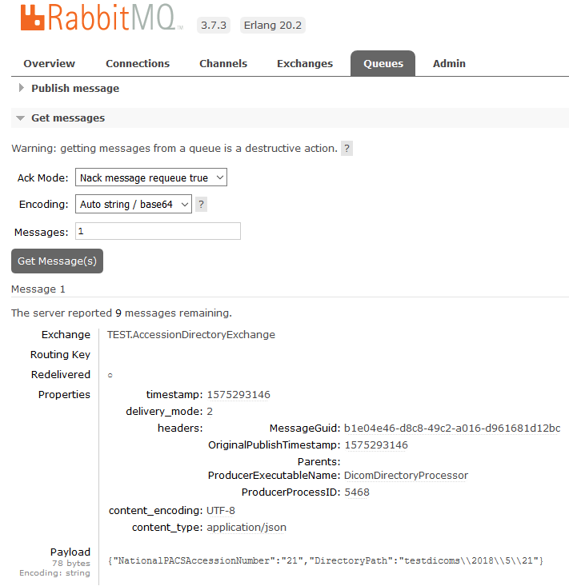

# Data Loading

## Contents

- [Background](#background)
- [Preparation](#preparation)
  - [Publish Binaries](#publish-binaries)
- [Microservices](#microservices)
  - [DicomDirectoryProcessor](#dicomdirectoryprocessor)
  - [DicomTagReader](#dicomtagreader)

## Background

This document describes all the steps required to setup data load microservices and use them to load a collection of Dicom images.

## Preparation

Download [Bad Dicom](https://github.com/HicServices/BadMedicine.Dicom/releases) and use it to generate some test images on disk:

```
BadDicom.exe c:\temp\testdicoms
```


Ensure Mongo Db is running e.g.:

```
C:\Program Files\MongoDB\Server\3.6\bin> ./mongod
```

Ensure RabbitMQ is running e.g.:

```
C:\Program Files\RabbitMQ Server\rabbitmq_server-3.7.3\sbin> .\rabbitmq-server.bat start
```

Ensure the target DBMS is running e.g.:

```
E:\mysql-5.7.19-winx64\bin> ./mysqld
```

Delete all RabbitMQ exchanges and queues:

```
http://127.0.0.1:15672/#/queues
```

Follow instructions listed in https://stackoverflow.com/a/52002145/4824531

### Publish Binaries

For each microservice run `dotnet publish -r win-x64` e.g.

```
E:\SmiServices\src\applications\Applications.DicomDirectoryProcessor> dotnet publish -r win-x64
```


## Microservices

### DicomDirectoryProcessor

Run `DicomDirectoryProcessor` with the directory you created test dicom files in e.g.:

```
E:\SmiServices\src\applications\Applications.DicomDirectoryProcessor\bin\AnyCPU\Debug\netcoreapp2.2\win-x64> .\DicomDirectoryProcessor.exe -d C:\temp\testdicoms
```

This may cause the following error:

```
Failed to construct host:
System.IO.FileNotFoundException: Could not find the logging configuration in the current directory (Smi.NLog.config),
```

Copy and modify (if needed) [Smi.NLog.config] to the binary directory


Run the application again, this time you should see:

```
Failed to construct host:
System.ApplicationException: The given control exchange was not found on the server: "TEST.ControlExchange"
```

Create the exchange:

---


---

This is the exchange by which you can send runtime messages (e.g. shutdown) to the service

Now when it is run you will see an error relating to another missing exchange (probably `TEST.AccessionDirectoryExchange`)

Create the following exchanges:

- TEST.AccessionDirectoryExchange
- TEST.FatalLoggingExchange

Now when running you should see an error:

```
2019-12-02 13:18:50.6045|FATAL|DicomDirectoryProcessorHost|Could not confirm message published after timeout|System.ApplicationException: Could not confirm message published after timeout
```

This is because there is no queue associated with the output exchange.  Create a queue `TEST.AccessionDirectoryQueue`

---


---
Bind the `TEST.AccessionDirectoryExchange` exchange with the queue `TEST.AccessionDirectoryQueue`:

---


---

Once you have done this you should see output from the program like:

```
PS E:\SmiServices\src\applications\Applications.DicomDirectoryProcessor\bin\AnyCPU\Debug\netcoreapp2.2\win-x64> .\DicomDirectoryProcessor.exe -d C:\temp\testdicoms
Bootstrapper -> Main called, constructing host
2019-12-02 13:25:45.6886| INFO|DicomDirectoryProcessorHost|Host logger created with SMI logging config|||
2019-12-02 13:25:45.7365| INFO|DicomDirectoryProcessorHost|Started DicomDirectoryProcessor:5468|||
2019-12-02 13:25:45.8932| INFO|DicomDirectoryProcessorHost|Creating basic directory finder|||
Bootstrapper -> Host constructed, starting aux connections
Bootstrapper -> Host aux connections started, calling Start()
2019-12-02 13:25:45.9435| INFO|BasicDicomDirectoryFinder|Starting directory scan of: C:\temp\testdicoms|||
2019-12-02 13:25:46.1277| INFO|BasicDicomDirectoryFinder|Directory scan finished|||
2019-12-02 13:25:46.1277| INFO|BasicDicomDirectoryFinder|Total messages sent: 10|||
2019-12-02 13:25:46.1277| INFO|BasicDicomDirectoryFinder|Largest stack size was: 10|||
2019-12-02 13:25:46.1277| INFO|BasicDicomDirectoryFinder|Averages:
NewDirInfo:     0ms
EnumFiles:      0ms
FirstOrDef:     0ms
FoundNewDir:    17ms
EnumDirs:       0ms
PushDirs:       0ms
|||
2019-12-02 13:25:46.1277| INFO|DicomDirectoryProcessorHost|Host Stop called: Directory scan completed|||
2019-12-02 13:25:46.4812| INFO|DicomDirectoryProcessorHost|Host stop completed|||
Bootstrapper -> Host started
Bootstrapper -> Exiting main
```

There should be 1 message per folder in the your test dicoms directory:

---


---

If you use GetMessages in the rabbit MQ interface you can see what was the messages contain:

---



---

Thats right, all this work was just to get a __directory listing__ into RabbitMQ! But now that you have the basics of creating exchanges / queues down it should be much easier to get the rest of the services running (see below).

To change the exchange/queue names you should edit `default.yaml` (ensuring your RabbitMQ server has the correct entries)

### DicomTagReader

Publish and run DicomTagReader (copy across [Smi.NLog.config] if needed) e.g.:

```
E:\SmiServices\src\microservices\Microservices.DicomTagReader\bin\AnyCPU\Debug\netcoreapp2.2\win-x64> ./DicomTagReader.exe
```

This should result in an error about `TEST.IdentifiableSeriesExchange`.  Create the following exchanges:

- TEST.IdentifiableSeriesExchange
- TEST.IdentifiableImageExchange

This should cause our old friend:

```
Could not confirm message published after timeout
```


[Smi.NLog.config]: ../data/logging/Smi.NLog.config